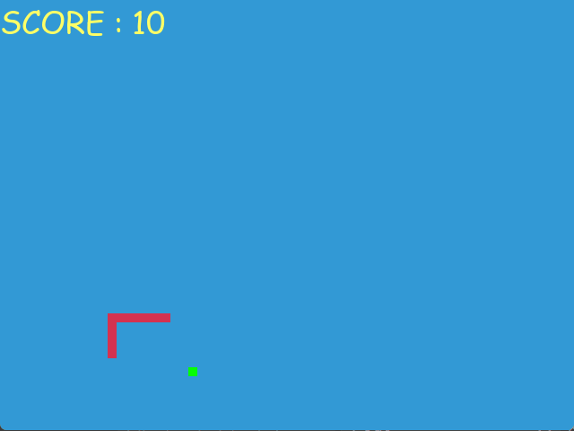

# 🐍 Snake Game using Python

A classic, interactive Snake Game built with Python and the pygame library. This project demonstrates basic game logic, collision detection, and GUI development.

<p align="center">
  
  <br>
  <i>Gameplay Demo: The snake growing as it eats food while avoiding the walls.</i>
</p>

## 🎮 Features
* **Real-time Movement:** Smooth controls using the arrow keys.
* **Score Tracking:** Keeps track of your current score as you eat.
* **Game Over Logic:** Detects collisions with walls or the snake's own body.
* **Dynamic Growth:** The snake increases in length every time it consumes food.

## 🛠️ Built With

* **pygame:** For the graphical user interface.
* **Random:** For generating food at random coordinates.

## 🚀 How to Run
To run this game on your local machine, follow these steps:

1. **Clone the repository:**
   ```bash
   git clone [https://github.com/your-username/Snake_Game_using_Python.git](https://github.com/your-username/Snake_Game_using_Python.git)
